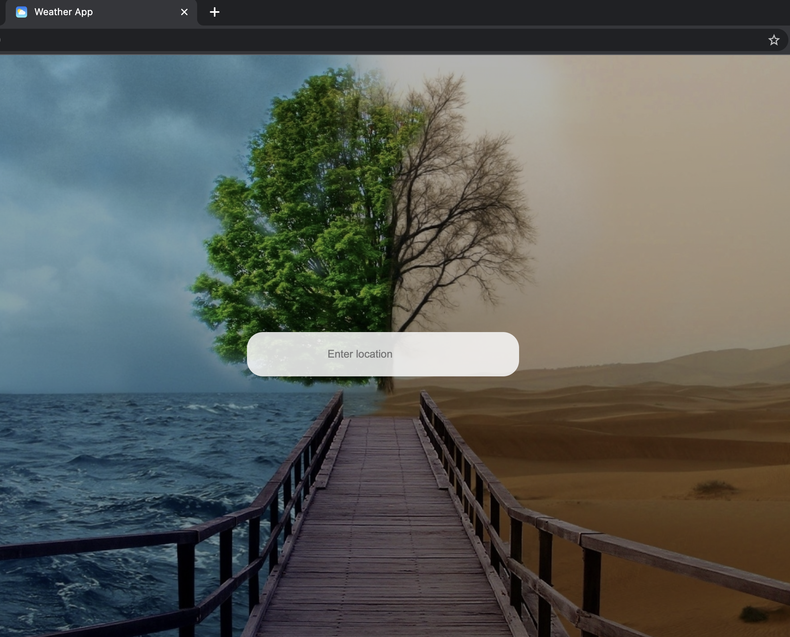
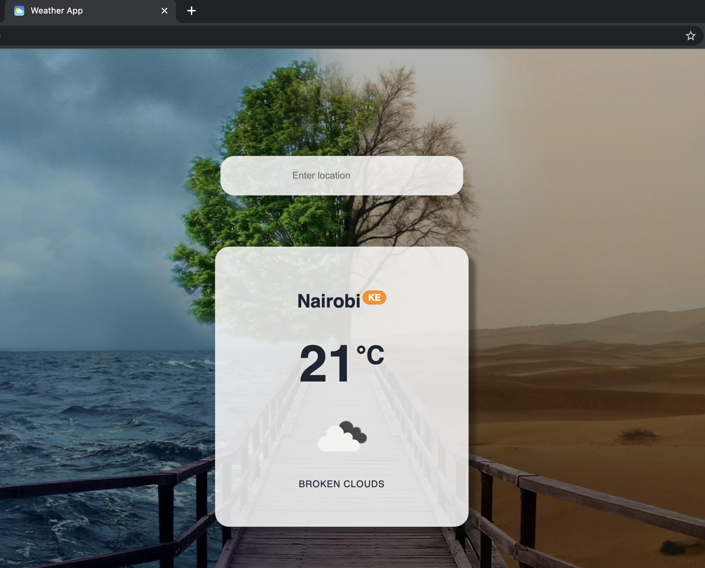
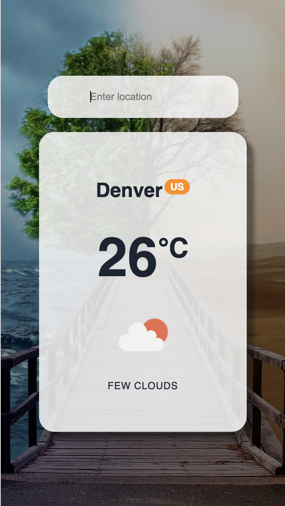

# PWA
A progressive web application developed with react

## Misc
- service workers (a JS file that keeps running all the time after opening the page), using them we can send push notifications, show somthing even when offline

## Display
- Web view 1

- Web view 2

- Mobile View

